# LEO Satellite Uplink “Jamming & Spoofing” Simulation Lab

## 🚀 Project Overview

This project is a **Defence-grade simulation lab** that models a **Command Link Intrusion** scenario for Low Earth Orbit (LEO) satellites. It simulates the critical security battle between a legitimate Ground Station, a Rogue Attacker, and a Satellite's onboard "Space Firewall".

The system demonstrates how cryptographic defenses (HMAC-SHA256) are essential to protect satellite command uplinks from spoofing, replay attacks, and unauthorized control.

### 🛰️ System Components

1.  **Legitimate Ground Station**: Generates authentic CCSDS (Consultative Committee for Space Data Systems) command packets, signed with a shared secret key using HMAC-SHA256.
2.  **Rogue Ground Station (Attacker)**: Crafts malicious packets, attempts to spoof the Ground Station ID, and injects unauthorized commands (e.g., "SHUTDOWN") with invalid or missing signatures.
3.  **LEO Satellite "Space Firewall"**: The defender. It receives all uplink traffic, validates CCSDS headers, checks timestamps to prevent replay attacks, and cryptographically verifies every command using HMAC. Only valid commands are executed; attacks are logged to a telemetry stream.

---

## 🛡️ Attack & Defense Model

### The Threat: Command Link Intrusion
In this scenario, an attacker has gained the ability to transmit RF signals to the satellite's uplink receiver. They are attempting to:
*   **Spoof Commands**: Send fake instructions like `SHUTDOWN` or `ADJUST_THRUST`.
*   **Replay Attacks**: Record a valid command and send it again later to disrupt operations.
*   **Jamming/Flooding**: Overwhelm the receiver with noise or garbage data.

### The Defense: HMAC-SHA256 Authentication
The satellite employs a "Space Firewall" that enforces strict authentication:
*   **Integrity**: HMAC ensures the command payload has not been tampered with.
*   **Authenticity**: The shared secret key proves the command came from the legitimate Ground Station.
*   **Freshness**: Timestamps in the CCSDS secondary header prevent replay attacks (commands older than 60 seconds are dropped).

---

## 🛠️ Installation

1.  **Clone the repository**:
    ```bash
    git clone https://github.com/your-username/leo-satellite-sim.git
    cd leo-satellite-sim
    ```

2.  **Install dependencies**:
    ```bash
    pip install -r requirements.txt
    ```

---

## 🎮 Usage (CLI)

The simulation is controlled via a powerful Command Line Interface (CLI).

### 1. Send a Legitimate Command
Simulate the authorized Ground Station sending a command to adjust thrust.
```bash
python -m satellite_sim.cli.sat_cli send --station legit --cmd "ADJUST_THRUST"
```
**Expected Result**: The satellite accepts and executes the command.

### 2. Launch a Spoofing Attack
Simulate a Rogue Station attempting to shut down the satellite.
```bash
python -m satellite_sim.cli.sat_cli send --station rogue --cmd "SHUTDOWN_REACTOR" --attack-type BAD_SIGNATURE
```
**Expected Result**: The satellite rejects the packet due to "Invalid HMAC Signature" and logs a Security Event.

### 3. View Telemetry & Security Logs
Check the satellite's internal logs to see the history of accepted commands and blocked attacks.
```bash
python -m satellite_sim.cli.sat_cli watch-telemetry
```

### 4. Export Security Report
Generate a summary of all security events.
```bash
python -m satellite_sim.cli.sat_cli export-report
```

---

## 📊 Telemetry & Logging

The system generates detailed logs for analysis:
*   `telemetry.log`: A human-readable stream of all satellite events.
*   `security_events.json`: A structured log of all intrusion attempts for automated analysis.

**Example Telemetry Output**:
```text
[Fri Nov 20 08:00:00 2024] [INFO] COMMAND_EXECUTED: {'command': 'ADJUST_THRUST'}
[Fri Nov 20 08:00:05 2024] [CRITICAL] SECURITY_VIOLATION: {'reason': 'Invalid HMAC Signature', 'signature_received': 'a1b2c3d4...'}
```

---

## 🏗️ Architecture

```mermaid
graph TD
    GS[Legitimate Ground Station] -->|Signed CCSDS Packet| Uplink((RF Uplink Channel))
    Rogue[Rogue Station] -->|Spoofed Packet| Uplink
    
    Uplink -->|Raw Stream| Sat[Satellite Receiver]
    
    subgraph "Satellite Onboard System"
        Sat --> Firewall[Space Firewall]
        Firewall -->|Validate HMAC| Verifier[Crypto Verifier]
        Verifier -->|Valid| Exec[Command Processor]
        Verifier -->|Invalid| Logger[Security Logger]
    end
    
    Logger --> Telemetry[Telemetry Downlink]
    Exec --> Telemetry
```



---

## ✨ Key Features

- ✅ **CCSDS-Compliant Packet Generation** - Industry-standard spacecraft command formatting
- ✅ **HMAC-SHA256 Authentication** - Cryptographic command verification
- ✅ **Replay Attack Prevention** - Timestamp-based freshness validation
- ✅ **Multi-Station Simulation** - Both legitimate and rogue ground stations
- ✅ **Space Firewall** - Production-grade packet validation logic
- ✅ **Security Telemetry** - Comprehensive logging (text + JSON)
- ✅ **CLI Interface** - Professional command-line tool with Rich formatting
- ✅ **Full Test Suite** - Unit tests for crypto and packet handling
- ✅ **CI/CD Ready** - GitHub Actions workflow included

---

## 🎬 Quick Demo

Run the full demonstration script:

```bash
source venv/bin/activate
python demo.py
```

This will execute:
- 3 legitimate commands (all accepted ✅)
- 3 attack attempts (all blocked ❌)
- Telemetry review
- Security report export

**Expected Output**:
```
✅ COMMAND_EXECUTED: ADJUST_THRUST
❌ SECURITY_VIOLATION: Invalid HMAC Signature
❌ PACKET_REJECTED: Packet too short
```

---

## 🧪 Testing

Run the test suite:

```bash
make test
```

Or manually:

```bash
source venv/bin/activate
python -m pytest tests/ -v
```

**Test Coverage**:
- HMAC signing and verification
- Packet structure validation
- Tampering detection
- Signature forgery prevention

---

## 🎯 Use Cases

This simulation is ideal for:
- 🎓 **Aerospace Security Research** - Study command link vulnerabilities
- 📚 **Educational Labs** - Teach cryptographic protocols in space systems
- 💼 **Portfolio Projects** - Demonstrate security engineering skills
- 🔬 **IoT/OT Security** - Model authenticated command channels

---

## 📝 Resume/Portfolio Hook

**Portfolio Description**:

> "Designed and implemented a **LEO Satellite Command Link Security Simulator** using **CCSDS standards** and **HMAC-SHA256 cryptographic authentication** to model real-world satellite intrusion scenarios. The system simulates legitimate Ground Station operations, adversarial spoofing attacks, and an onboard 'Space Firewall' that validates packet integrity, prevents replay attacks, and logs security violations. The project demonstrates expertise in **aerospace protocols**, **cryptographic authentication**, **Python development**, and **defense-in-depth security architecture**."

**Skills Demonstrated**:
- Aerospace Command & Control Protocols (CCSDS)
- Cryptographic Engineering (HMAC-SHA256)
- Security Architecture & Threat Modeling
- Python Development (Type Hints, Testing, CLI)
- DevSecOps (CI/CD, Documentation, Code Quality)

---

## 📚 Additional Documentation

- [**ARCHITECTURE.md**](ARCHITECTURE.md) - System design and threat model
- [**CONTRIBUTING.md**](CONTRIBUTING.md) - Contribution guidelines
- [**SECURITY.md**](SECURITY.md) - Security policy
- [**CHANGELOG.md**](CHANGELOG.md) - Version history

---

## 📜 License

MIT License. See `LICENSE` for details.

---

## 🙏 Acknowledgments

- **CCSDS** (Consultative Committee for Space Data Systems) for protocol standards
- **ccsdspy** library for Python CCSDS parsing
- Inspired by real-world satellite security research and aerospace cybersecurity principles

---

**⭐ If this project demonstrates the kind of security engineering you need, star it!**
